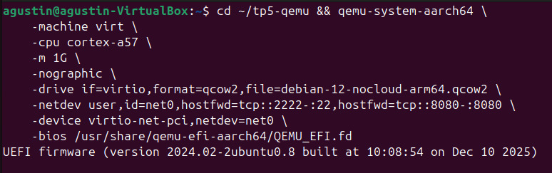
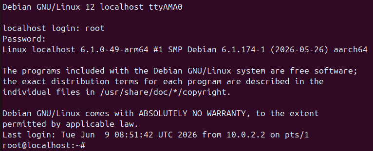
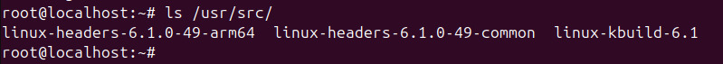
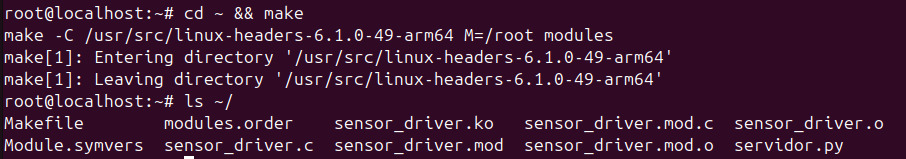
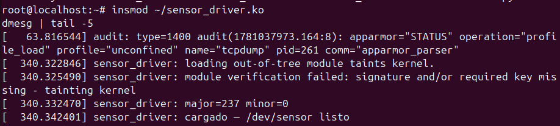
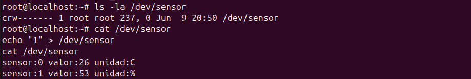
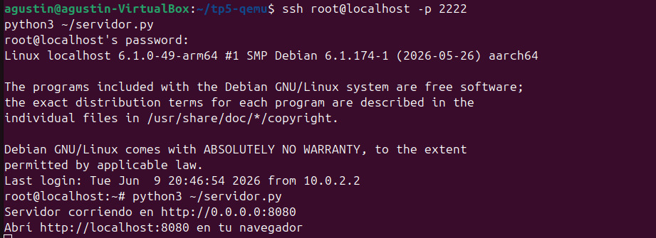
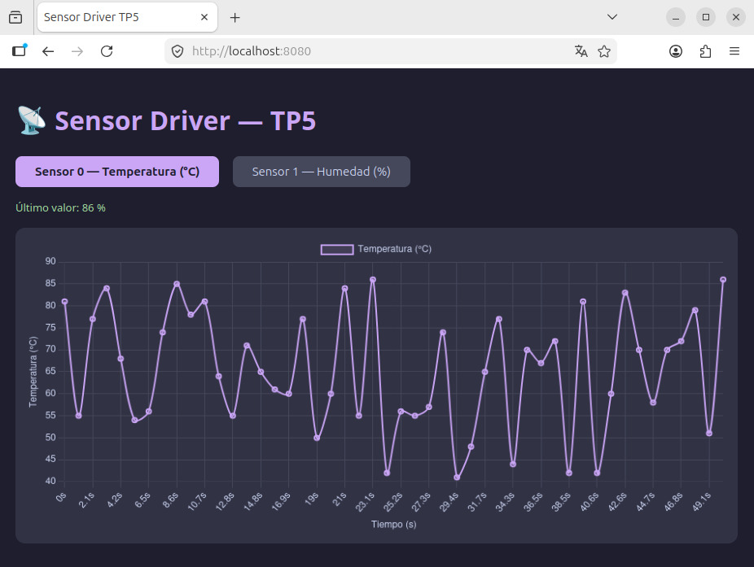
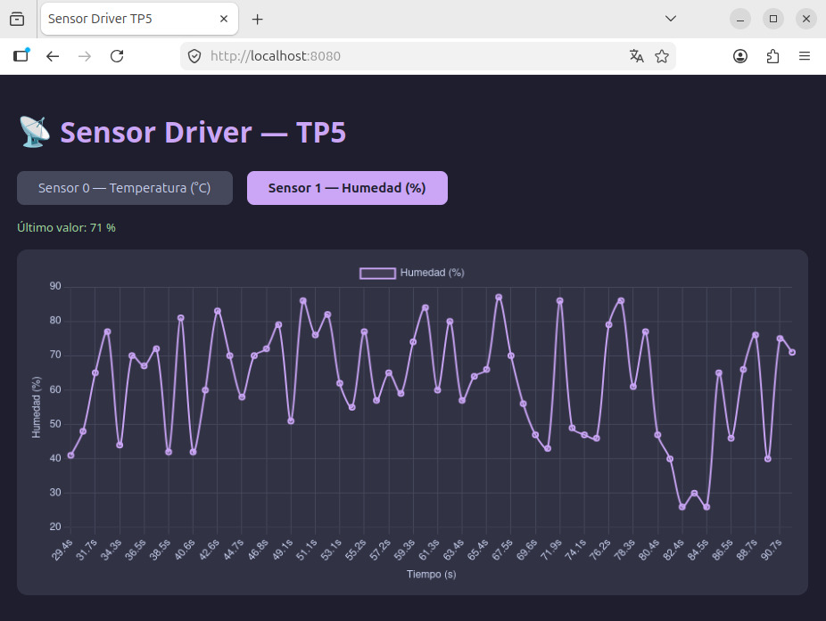

# Universidad Nacional de Córdoba
## Facultad de Ciencias Exactas, Físicas y Naturales

---

**Asignatura:** Sistemas de Computación

**Trabajo Práctico N° 5: Device Drivers**

**Docentes:**

Ing. Miguel Ángel Solinas

Ing. Javier Alejandro Jorge

**Alumnos:**
- Benavides, María Candela - 45.559.700  
- Mendes Rosa, Agustín - 44.517.201  
- Monja, Ernesto Joaquín - 43.873.728  

---

## 1. Introducción

Este trabajo práctico tiene como objetivo el diseño e implementación de un CDD 
(Character Device Driver) utilizando los conceptos aprendidos sobre módulos del
kernel de Linux.

Se desarrolló un driver capaz de exponer dos señales simuladas al espacio de usuario
con un período de muestreo de un segundo, junto con una aplicación que las grafica
en tiempo real desde el navegador web.

---

## 2. Marco teórico

### 2.1 ¿Qué es un driver?

Un driver es una pieza de software que actúa como intermediario entre el sistema
operativo y el hardware. Su función es abstraer los detalles físicos del dispositivo y
ofrecer una interfaz uniforme para que las aplicaciones puedan usarlo sin conocer
cómo funciona internamente. Pueden distinguirse dos términos:

- **Device driver:** software que gestiona directamente un dispositivo físico.
- **Device controller:** hardware que controla otros dispositivos y que, a su vez,
  necesita su propio driver (llamado *bus driver*) para ser manejado por el sistema
  operativo.

Todo device driver tiene dos caras: una orientada al hardware específico que controla,
y otra orientada al sistema operativo con el que se integra.

### 2.2 Clasificación de drivers en Linux

Linux organiza los drivers en tres categorías según el tipo de acceso que realizan:

| Categoría | Tipo de dato | Ejemplos típicos |
|-----------|-------------|-----------------|
| Network   | Paquetes    | Ethernet, Wi-Fi, Bluetooth |
| Block     | Bloques     | Discos duros, SSDs, tarjetas SD |
| Character | Bytes       | Puertos serie, audio, GPIO, teclados |

Los archivos que representan a estos dispositivos viven en el directorio `/dev`.
Para listar los character devices activos en el sistema se puede usar:

```bash
ls -l /dev/ | grep "^c"
cat /proc/devices
```

### 2.3 Character Device Driver (CDD)

Los CDD son el grupo más numeroso dentro de los drivers de Linux. Todo driver que
no sea de almacenamiento ni de red entra en esta categoría. Ejemplos cotidianos son
los controladores de puertos seriales, placas de audio, cámaras y GPIO.

### 2.4 Modelo de capas

La arquitectura de un CDD sigue un modelo de capas bien definido:

```
Aplicación de usuario
       |
       │  ← vínculo por nombre de archivo
       |
Character Device File (CDF)  →  (/dev/sensor)
       |
       │  ← vínculo por número major/minor
       |
Character Device Driver (CDD)  →  (módulo .ko en el kernel)
       │
       |
       |
Hardware / señal simulada
```

El dato importante acá es que la aplicación conoce al dispositivo por su **nombre**
(`/dev/sensor`), pero el kernel lo identifica internamente por su **número**. Eso
permite que el nombre del archivo sea arbitrario sin afectar el funcionamiento del
driver.

### 2.5 Números major y minor

Cada dispositivo de caracteres lleva asociado un par de identificadores:

- **Major number:** identifica al driver que lo maneja.
- **Minor number:** distingue entre instancias del mismo driver.

El kernel los almacena juntos en el tipo `dev_t` (32 bits: 12 para major, 20 para
minor). Las macros para trabajar con ellos son:

```c
MAJOR(dev_t dev)            // extrae el major
MINOR(dev_t dev)            // extrae el minor
MKDEV(int major, int minor) // construye un dev_t
```

Para registrar el rango dinámicamente (sin elegir el número a mano):

```c
alloc_chrdev_region(&dev_number, 0, NUM_DEVICES, DRIVER_NAME);
```


### 2.6 Ciclo de vida de un módulo

Un módulo del kernel (`.ko`) se puede insertar y remover sin reiniciar
el sistema. Tiene dos funciones obligatorias:

- **`module_init`:** se ejecuta al hacer `insmod`. Acá se reservan recursos,
  se registra el dispositivo y se crea el nodo.
- **`module_exit`:** se ejecuta al hacer `rmmod`. Libera todo lo que reservó el
  init, en orden inverso.

Los mensajes de diagnóstico se escriben con `printk()` y se leen con `dmesg`.

---

## 3. Entorno de desarrollo

Al no disponer de hardware físico, se utilizó QEMU como entorno de emulación,
opción contemplada explícitamente por la cátedra.

Se eligió la máquina genérica `virt` de `qemu-system-aarch64` con un procesador
Cortex-A57, corriendo Debian 12 arm64. Esta combinación ofrece red y SSH
confiables mediante virtio, instalación sencilla de headers con `apt` y compilación
sin conflictos de versión.

La contrapartida es que la máquina `virt` no expone GPIO físico. Para resolverlo,
las dos señales son generadas internamente por el driver con valores calculados.
La lógica de muestreo periódico, selección de canal y entrega al espacio de usuario
es exactamente la misma que se usaría leyendo pines reales; solo cambia la fuente
del dato.

**Resumen del entorno:**

| Componente | Detalle |
|---|---|
| Host | Ubuntu x86-64 (VirtualBox) |
| Emulador | QEMU `qemu-system-aarch64`, máquina `virt` |
| CPU emulada | ARM Cortex-A57 (64 bits) |
| Sistema invitado | Debian 12 arm64 |
| Kernel invitado | 6.1.0-49-arm64 |
| Puerto SSH | 2222 (host) → 22 (VM) |
| Puerto web | 8080 (host) → 8080 (VM) |

**Señales simuladas:**

| Canal | Señal | Rango | Unidad |
|---|---|---|---|
| 0 | Temperatura simulada | 20 – 35 | °C |
| 1 | Humedad simulada | 40 – 90 | % |

Se les asignó una magnitud física a cada sensor para simular una aplicación específica 
de un sistema embebido que mida valores reales.

---

## 4. Implementación del CDD

El archivo `sensor_driver.c` implementa un CDD completo. Al cargarse, ejecuta
los siguientes pasos en orden:

1. `alloc_chrdev_region()` — pide al kernel un major libre.
2. `cdev_init()` + `cdev_add()` — registra el dispositivo y lo vincula con las
   funciones de archivo.
3. `class_create()` — crea la clase en `/sys/class/sensor_class/`.
4. `device_create()` — dispara a udev para que cree `/dev/sensor` automáticamente.

### Operaciones implementadas

| Función | Cuándo se invoca | Qué hace |
|---|---|---|
| `my_open()` | `open("/dev/sensor")` | Registra la apertura en el log |
| `my_close()` | `close()` | Registra el cierre en el log |
| `my_read()` | `cat /dev/sensor` o `read()` | Devuelve el valor del sensor activo |
| `my_write()` | `echo "1" > /dev/sensor` o `write()` | Cambia el sensor activo |

La función `read()` devuelve una línea con este formato:

```
sensor:0 valor:27 unidad:C
sensor:1 valor:63 unidad:%
```

Al descargarse, `module_exit` libera todos los recursos en orden inverso al init:
`device_destroy` → `class_destroy` → `cdev_del` → `unregister_chrdev_region`.

---

## 5. Aplicación de usuario y visualización

La aplicación `servidor.py` corre en Python 3 dentro de la VM. Tiene dos partes que
corren en paralelo mediante hilos:

- **Hilo de lectura:** abre `/dev/sensor` cada segundo, parsea la respuesta y
  acumula hasta 60 muestras en un buffer circular.
- **Servidor HTTP:** atiende tres rutas en el puerto 8080.

**Rutas del servidor:**

| Ruta | Descripción |
|---|---|
| `/` | Sirve la página HTML con el gráfico |
| `/datos` | Devuelve las muestras en JSON |
| `/cambiar?sensor=N` | Escribe `N` en `/dev/sensor` y cambia el canal activo |

La interfaz web usa Chart.js (cargado desde CDN) y muestra:

- Gráfico de línea actualizado cada segundo.
- Eje X: tiempo en segundos.
- Eje Y: valor con su unidad (°C o %).
- Botones para cambiar entre Sensor 0 y Sensor 1.
- Al cambiar de sensor, el gráfico se resetea automáticamente.

La visualización es accesible desde el navegador del host gracias al reenvío de
puertos configurado en el comando de QEMU (`hostfwd=tcp::8080-:8080`).

---

## 6. Flujo de trabajo

### 6.1 Preparación del entorno (una sola vez)

Instalar dependencias en el host:

```bash
sudo apt update && sudo apt install -y \
    qemu-system-arm \
    gcc-aarch64-linux-gnu \
    build-essential \
    wget \
    openssh-client
```

Descargar la imagen de Debian ARM64:

```bash
mkdir -p ~/tp5-qemu && cd ~/tp5-qemu
wget https://cloud.debian.org/images/cloud/bookworm/latest/debian-12-nocloud-arm64.qcow2
```

### 6.2 Arrancar la VM

```bash
cd ~/tp5-qemu

qemu-system-aarch64 \
    -machine virt \
    -cpu cortex-a57 \
    -m 1G \
    -nographic \
    -drive if=virtio,format=qcow2,file=debian-12-nocloud-arm64.qcow2 \
    -netdev user,id=net0,hostfwd=tcp::2222-:22,hostfwd=tcp::8080-:8080 \
    -device virtio-net-pci,netdev=net0 \
    -bios /usr/share/qemu-efi-aarch64/QEMU_EFI.fd
```

Esperar el prompt `localhost login:` e ingresar con usuario (`root`).

### 6.3 Conectarse por SSH

En una segunda terminal del host:

```bash
ssh root@localhost -p 2222
```

### 6.4 Instalar dependencias dentro de la VM (una sola vez)

```bash
apt update
apt install -y openssh-server linux-headers-$(uname -r) \
               build-essential gcc make python3

echo "PermitRootLogin yes" >> /etc/ssh/sshd_config
systemctl restart ssh
```

### 6.5 Transferir el código fuente

Desde el host:

```bash
scp -P 2222 ~/tp5-driver/driver/sensor_driver.c root@localhost:/root/
```

Crear el Makefile dentro de la VM:

```bash
cat > ~/Makefile << 'EOF'
MODULE_NAME := sensor_driver
KERNEL_DIR  := /usr/src/linux-headers-$(shell uname -r)
obj-m       := $(MODULE_NAME).o
all:
	$(MAKE) -C $(KERNEL_DIR) M=$(PWD) modules
clean:
	$(MAKE) -C $(KERNEL_DIR) M=$(PWD) clean
EOF
```

### 6.6 Compilar el driver

Dentro de la VM:

```bash
cd ~ && make
```

Salida esperada:

```
  CC [M]  /root/sensor_driver.o
  MODPOST /root/Module.symvers
  CC [M]  /root/sensor_driver.mod.o
  LD [M]  /root/sensor_driver.ko
```

### 6.7 Cargar el driver

```bash
insmod ~/sensor_driver.ko
dmesg | tail -5
```

Salida esperada en dmesg:

```
sensor_driver: major=237 minor=0
sensor_driver: cargado — /dev/sensor listo
```

Verificar que el nodo fue creado automáticamente:

```bash
ls -la /dev/sensor
```

### 6.8 Probar desde la terminal

```bash
cat /dev/sensor          # lee sensor 0
echo "1" > /dev/sensor  # cambia a sensor 1
cat /dev/sensor          # lee sensor 1
```

### 6.9 Lanzar el servidor web

```bash
python3 ~/servidor.py
```

### 6.10 Ver el gráfico

Abrir en el navegador del host:

```
http://localhost:8080
```

### Inicio rápido (sesiones posteriores)

```bash
# Terminal 1 — arrancar la VM
cd ~/tp5-qemu && qemu-system-aarch64 \
    -machine virt -cpu cortex-a57 -m 1G -nographic \
    -drive if=virtio,format=qcow2,file=debian-12-nocloud-arm64.qcow2 \
    -netdev user,id=net0,hostfwd=tcp::2222-:22,hostfwd=tcp::8080-:8080 \
    -device virtio-net-pci,netdev=net0 \
    -bios /usr/share/qemu-efi-aarch64/QEMU_EFI.fd

# Terminal 2 — entrar por SSH y correr todo
ssh root@localhost -p 2222
insmod ~/sensor_driver.ko
python3 ~/servidor.py

# Navegador → http://localhost:8080
```

---

## 7. Pruebas y resultados

### Arranque de la VM

<div align="center">
  
  <i>Comando QEMU en la terminal.</i>
</div>

<div align="center">
  
  <i>Prompt `localhost login:` luego del booteo.</i>
</div>

<div align="center">
  
  <i>Conexión desde otra terminal a la VM.</i>
</div>


### Verificación de instalación de headers

<div align="center">
  
  <i>Headers instalados en la VM — salida del `ls /usr/src/`.</i>
</div>

### Creación del kernel object

<div align="center">
  
  <i>Compilación exitosa — salida del `make` con la presencia de `sensor_driver.ko`.</i>
</div>

### Carga del driver y confirmación

<div align="center">
  
  <i>Carga del driver — `dmesg` mostrando major asignado y mensaje de carga, más `ls -la /dev/sensor` confirmando la creación automática del nodo.</i>
</div>

### Prueba del sensor y selección

<div align="center">
  
  <i>Prueba desde terminal — secuencia de `cat`, `echo "1" >` y segundo `cat` mostrando el cambio de sensor.</i>
</div>

### 

<div align="center">
  
  <i>Lanzamiento del servidor con Python.</i>
</div>

### Interfaz web - Gráficos de sensores

<div align="center">
  
  <i>Sensor 0 (temperatura) graficándose en tiempo real.</i>
</div>

<div align="center">
  
  <i>Sensor 1 (humedad) graficándose en tiempo real.</i>
</div>

---

## 8. Conclusiones

El trabajo permitió integrar de forma efectiva el espacio de usuario con el espacio
del kernel a través de un Character Device Driver. Se determinó el objetivo de cada 
módulo tal que el driver se ocupa exclusivamente del muestreo y la entrega de datos,
mientras que la aplicación maneja la presentación y la interacción con el usuario.

El ejercicio confirma que delegar el acceso al hardware a un módulo del kernel, en
lugar de hacerlo directamente desde una aplicación, es una buena práctica, ya que 
exponer el dispositivo como un archivo en `/dev/` simplifica la interfaz para el 
espacio de usuario y aprovecha los mecanismos de protección del kernel.

La solución final exhibe una arquitectura de tres capas bien definidas:

1. La fuente de datos (señales simuladas internamente por el driver).
2. El CDD como capa de abstracción, exponiendo `/dev/sensor`.
3. La aplicación de usuario que lee, procesa y grafica la información.